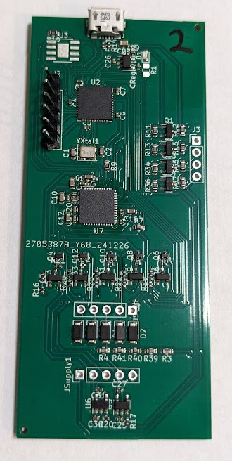

# Hello FPGA

This project is a simple firmware to help test the flashing process of the FPGA.

Using 4 output pins:
- One will always be on
- The other three represent the state of a 3 bit counter, which should increment
about once per second.

## PCB Note
This HDL was written to test the ICE40 Breakout board. While it can be flashed
onto any compatible board, the pin descriptions below assume you are using this
PCB.

	
	

## Voltage note

Note that while the IO on the FPGA is 3.3V, the breakout board includes
level shifters to map 3.3V to 5V on outputs.

## Pin assignments

These are applied in the pcf file. They are documented here for visibility.

| Function | FPGA Pin | FPGA Pin # | PCB Label / Position |
| -- | -- | -- | -- |
| Clk | FPGA_IOT46B | 35 | n/a |
| Always On | FPGA_IOB22A | 12 | Out_1, Closest to USB of IOs. J3 square on right edge of board|
| Ctr[0] (1s bit) | FPGA_IOB20A | 11 | Out_2, just below Out_1 |
| Ctr[1] (2s bit) | FPGA_IOB18A | 10 | Out_3, below Out_2 |
| Ctr[2] (4s bit) | FPGA_IOB16A | 9 | Out_4, Farthest from USB of IOs|

